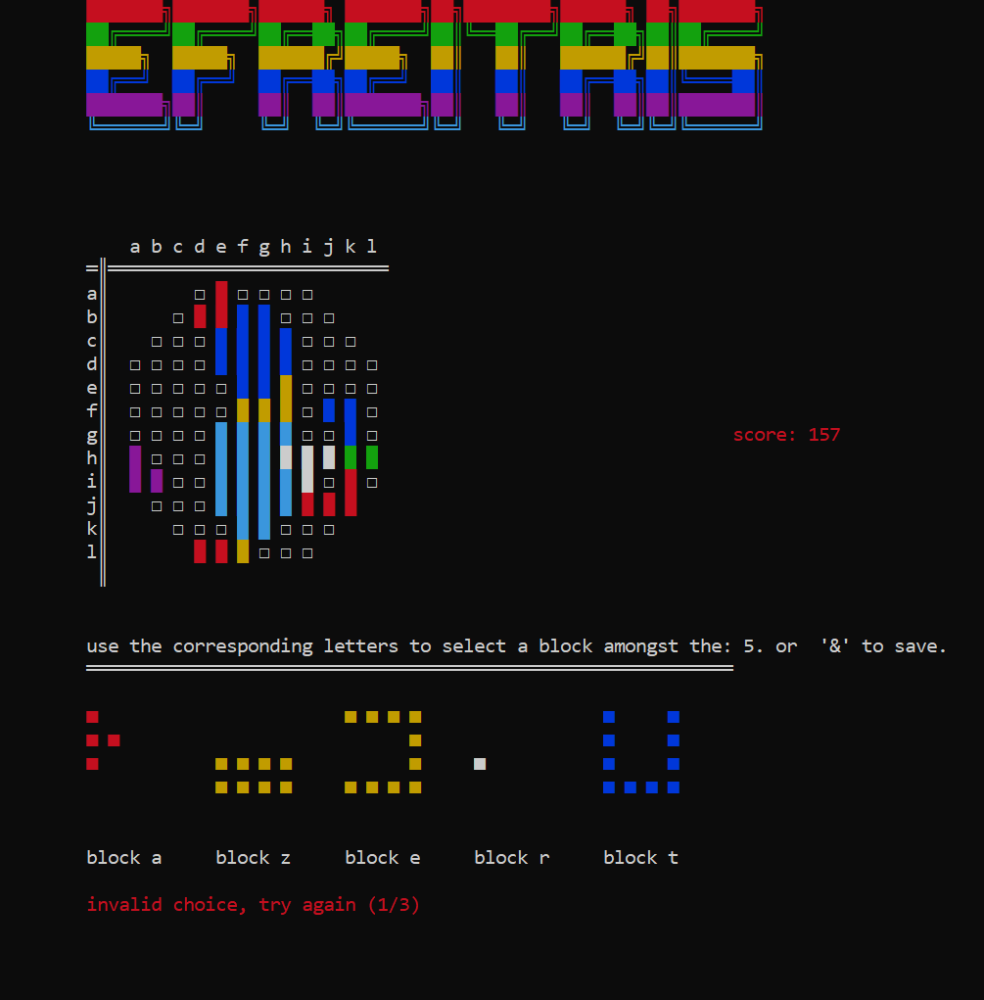

# EFREITRIS
> A python tetris-like game for our python class 2022


A single player terminal based game 



## Authors


Julien Boudjedid

Paul Leflon 


## Installation

OS X & Linux:

```sh
pip install -r requirements.txt
```

Windows:

```sh
pip install -r requirements.txt
```

## How to run

OS X & Linux:

```sh
bash run.sh
```
IMPORTANT: make sure your terminal window is at least 110x60 

Windows:

```
run.bat
```

Warning: on many devices the terminal window is too small to display the game properly. If you want to play the game, you will have to resize your terminal window to at least 110x70.

you know you are experiencing this issue if you get the error:

    ```
    curses.error: addwstr() returned ERR
    ```

to fix: 

  resize your terminal window to as large as possible

  dezoom your terminal if possible 

  alter the text size

  if these steps didn't work you can either contact us as julien.boudjedid@efrei.net or try on a seperate device.

## How to play

you use the azerty keys to move the piece, and the & piece to do it

## Functionalities

* 3 different levels - easy, medium, hard
* 3 different board shapes - circle, diamond, triangle
* 3 different game modes - easy, medium, hard
* save/load game option
* colorfull terminal
* many different tetrominoes

## Development setup

```sh
pip install -r requirements.txt
```


## Release History

* 0.2.1
    * CHANGE: Update docs (module code remains unchanged)
* 0.2.0
    * 
* 0.1.1
    * gameplay functions working
    * initiated work on gameloop
* 0.0.9
    * gameplay functions initiated
    * 
* 0.0.1
    * initiated shapes


  